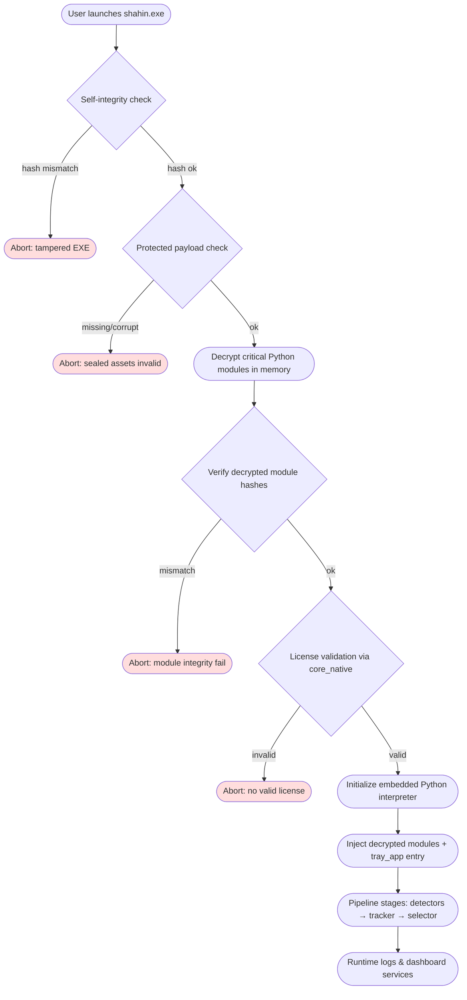

# Vehicle Plate Tracker - Extract Plate Image

Select the sharpest, best-quality frame of each unique license plate from a 120 FPS video stream.

## Features

- High frame-rate input (120 FPS).
- One output per unique plate (best frame).
- Accuracy > speed.
- Asynchronous-friendly pipeline.

## Protective System Overview



## Requirements

- Python 3.10+
- CPU-only inference
- Low hardware footprint (no GPU needed)

## Setup

### Windows
```sh
 py -m venv .venv
 .\.venv\Scripts\Activate.ps1  
c:\users\user\desktop\shahin-dev\.venv\scripts\python.exe -m pip install --upgrade pip
pip install -r .\requirements.txt
```


### Linux
```sh
python3 -m venv .venv
source .venv/bin/activate
pip install -r requirements.txt
```

## Offline Activation

- Launch `tray_app.py` in tray mode (e.g. `python tray_app.py`) — the tray icon will appear even without a license.
- Choose **Activate…** from the tray menu, copy the displayed machine fingerprint, and send it to the release team.
- The release team runs `python scripts/generate_license.py --fingerprint <fp> --customer <name>` (using the private key in `.keys/`) and sends back the resulting string.
- Paste the signed blob into the activation dialog and click **Validate**. A valid license is stored at `~/.shahin/license.json`.
- Once activated, Shahin keeps both backend and dashboard services alive automatically. During preview builds this behavior is mocked (TODO: wire up Windows service + startup registration), but the UX contract already assumes no manual startup is required—services restart on login and stay resident unless the user explicitly quits them via the tray or Task Manager.

## Demo Setup

### Fake plates
```sh
$ make seed-db
$ make web
```

- Download [MediaMTX](https://github.com/bluenviron/mediamtx/releases)

```sh
$ ./mediamtx
```

In another terminal, stream the sample video (acting as the input camera):
```sh
$ ffmpeg -re -stream_loop -1 -i output_1080p_120fps.mp4 -c copy -f rtsp -rtsp_transport tcp rtsp://127.0.0.1:8554/live.stream
```
Then run:
```sh
$ ./main.py
```
# Logging
## Quickstart: Loki + Promtail + Grafana (Docker Compose)

Start a local stack that collects `logs/app.jsonl` and provides a Grafana UI:

```bash
docker-compose up -d
```

After the stack starts:
- Grafana: http://localhost:3000 (user: admin / password: admin)

Promtail is configured to read `./logs/*.jsonl` and push to Loki. Use the provided `docker/promtail-config.yaml` if you need to tweak parsing or labels.

## DB Schema

```sql
-- from traffic → plate → metadata

CREATE TABLE IF NOT EXISTS plates (
    uuid TEXT PRIMARY KEY,
    plate_text TEXT NOT NULL UNIQUE,
    timestamp DATETIME DEFAULT CURRENT_TIMESTAMP
);

CREATE TABLE IF NOT EXISTS metadata (
    id INTEGER PRIMARY KEY AUTOINCREMENT,
    plate_uuid TEXT NOT NULL UNIQUE,
    car_type TEXT,
    car_color TEXT,
    car_owner TEXT,
    FOREIGN KEY (plate_uuid) REFERENCES plates(uuid)
);

CREATE TABLE IF NOT EXISTS traffic (
    id INTEGER PRIMARY KEY AUTOINCREMENT,
    plate_uuid TEXT NOT NULL,
    camera_location TEXT,
    timestamp DATETIME DEFAULT CURRENT_TIMESTAMP,
    FOREIGN KEY (plate_uuid) REFERENCES plates(uuid)
);

```

  ## High-Level Goal

  The main purpose of BestFrameSelector is to efficiently select the highest quality license plate image for each
  tracked vehicle without performing expensive processing (like OCR) on every single frame. It only runs the full OCR
  pipeline once per vehicle, after the vehicle has left the scene.

  ## How It Works: Step-by-Step

   1. Collecting Candidates (The `update` method)
       * Contrary to what the variable name most_confident_plate_crop might suggest, the class doesn't just store a single
         best frame. Instead, for each vehicle ID (vid), it maintains a list of the top 300 best plate candidates detected
         so far.
       * This list is stored in the dictionary self.most_confident_plate_crop.
       * When the update method is called with a new plate detection, it adds the new plate's confidence score, the plate
         crop image, and the full frame to a list associated with that vehicle's ID.
       * To keep the list from growing indefinitely, it's capped at 300 entries, always keeping the ones with the highest
         confidence scores.

   2. Deciding When to Finalize (The `to_finalize` method)
       * The selector keeps track of when each vehicle was last seen.
       * If a vehicle ID is no longer present in the current frame's active detections, a counter (missed_frames) starts.
       * If a vehicle remains unseen for a certain number of frames (defined by track_timeout), this method identifies its
         ID as ready "to be finalized." This assumes the vehicle has left the camera's view.

   3. Processing the Best Candidate (The `finalize` method)
       * Once a vehicle is marked for finalization, this method is called.
       * It retrieves the list of top 300 candidates for that vehicle from self.most_confident_plate_crop.
       * It then selects the single best candidate from this list by finding the one with the maximum confidence_score.
       * Only this single, best plate crop is then sent through the full, expensive OCR pipeline:
           1. Pre-processing: The image is cleaned up.
           2. Segmentation: The characters on the plate are isolated.
           3. Classification: Each character (glyph) is identified.
       * Finally, the resulting plate text is saved to the database, and the original frame and plate crop are saved to
         disk for auditing.

---

## Document
[link](https://docs.google.com/document/d/1_Q-legmeUw9Q5sP0G9K7ayoIYyhgSnebhKUnHNxscoQ/edit?tab=t.0#heading=h.z6ne0og04bp5)
